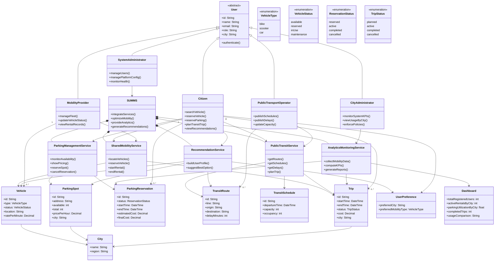

# SUMMS UML Class Diagram (Phase 1 Requirements)

```mermaid
classDiagram
    class SUMMS {
      +integrateServices()
      +optimizeMobility()
      +provideAnalytics()
      +generateRecommendations()
    }

    class User {
      <<abstract>>
      +id: String
      +name: String
      +email: String
      +role: String
      +city: String
      +authenticate()
    }

    class Citizen {
      +searchVehicle()
      +reserveVehicle()
      +reserveParking()
      +planTransitTrip()
      +viewRecommendations()
    }

    class MobilityProvider {
      +manageFleet()
      +updateVehicleStatus()
      +viewRentalRecords()
    }

    class PublicTransportOperator {
      +publishSchedules()
      +publishDelays()
      +updateCapacity()
    }

    class CityAdministrator {
      +monitorSystemKPIs()
      +viewUsageByCity()
      +enforcePolicies()
    }

    class SystemAdministrator {
      +manageUsers()
      +managePlatformConfig()
      +monitorHealth()
    }

    class SharedMobilityService {
      +locateVehicles()
      +reserveVehicle()
      +startRental()
      +endRental()
    }

    class ParkingManagementService {
      +monitorAvailability()
      +showPricing()
      +reserveSpot()
      +cancelReservation()
    }

    class PublicTransitService {
      +getRoutes()
      +getSchedules()
      +getDelays()
      +planTrip()
    }

    class AnalyticsMonitoringService {
      +collectMobilityData()
      +computeKPIs()
      +generateReports()
    }

    class RecommendationService {
      +buildUserProfile()
      +suggestBestOption()
    }

    class Vehicle {
      +id: String
      +type: VehicleType
      +status: VehicleStatus
      +location: String
      +ratePerMinute: Decimal
    }

    class ParkingSpot {
      +id: String
      +address: String
      +available: int
      +total: int
      +pricePerHour: Decimal
      +city: String
    }

    class ParkingReservation {
      +id: String
      +status: ReservationStatus
      +startTime: DateTime
      +endTime: DateTime
      +estimatedCost: Decimal
      +finalCost: Decimal
    }

    class TransitRoute {
      +id: String
      +line: String
      +origin: String
      +destination: String
      +delayMinutes: int
    }

    class TransitSchedule {
      +id: String
      +departureTime: DateTime
      +capacity: int
      +occupancy: int
    }

    class Trip {
      +id: String
      +startTime: DateTime
      +endTime: DateTime
      +status: TripStatus
      +cost: Decimal
      +city: String
    }

    class UserPreference {
      +preferredCity: String
      +preferredMobilityType: VehicleType
    }

    class Dashboard {
      +totalRegisteredUsers: int
      +activeRentalsByCity: int
      +parkingUtilizationByCity: float
      +completedTrips: int
      +usageComparison: String
    }

    class City {
      +name: String
      +region: String
    }

    class VehicleType {
      <<enumeration>>
      bike
      scooter
      car
    }

    class VehicleStatus {
      <<enumeration>>
      available
      reserved
      inUse
      maintenance
    }

    class ReservationStatus {
      <<enumeration>>
      reserved
      active
      completed
      cancelled
    }

    class TripStatus {
      <<enumeration>>
      planned
      active
      completed
      cancelled
    }

    User <|-- Citizen
    User <|-- MobilityProvider
    User <|-- PublicTransportOperator
    User <|-- CityAdministrator
    User <|-- SystemAdministrator

    SUMMS *-- SharedMobilityService
    SUMMS *-- ParkingManagementService
    SUMMS *-- PublicTransitService
    SUMMS *-- AnalyticsMonitoringService
    SUMMS *-- RecommendationService

    Citizen --> SharedMobilityService
    Citizen --> ParkingManagementService
    Citizen --> PublicTransitService
    Citizen --> RecommendationService

    MobilityProvider --> SharedMobilityService
    PublicTransportOperator --> PublicTransitService
    CityAdministrator --> AnalyticsMonitoringService
    SystemAdministrator --> SUMMS

    SharedMobilityService --> Vehicle
    SharedMobilityService --> Trip

    ParkingManagementService --> ParkingSpot
    ParkingManagementService --> ParkingReservation

    PublicTransitService --> TransitRoute
    PublicTransitService --> TransitSchedule
    PublicTransitService --> Trip

    RecommendationService --> UserPreference
    RecommendationService --> Vehicle
    RecommendationService --> TransitRoute
    RecommendationService --> ParkingSpot

    AnalyticsMonitoringService --> Trip
    AnalyticsMonitoringService --> ParkingReservation
    AnalyticsMonitoringService --> Dashboard

    Citizen "1" --> "0..1" UserPreference
    Citizen "1" --> "0..*" Trip
    Citizen "1" --> "0..*" ParkingReservation

    MobilityProvider "1" --> "0..*" Vehicle
    PublicTransportOperator "1" --> "0..*" TransitRoute

    Vehicle --> City
    ParkingSpot --> City
    Trip --> City
```
