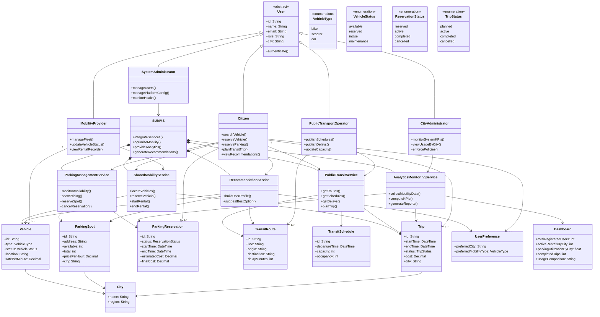
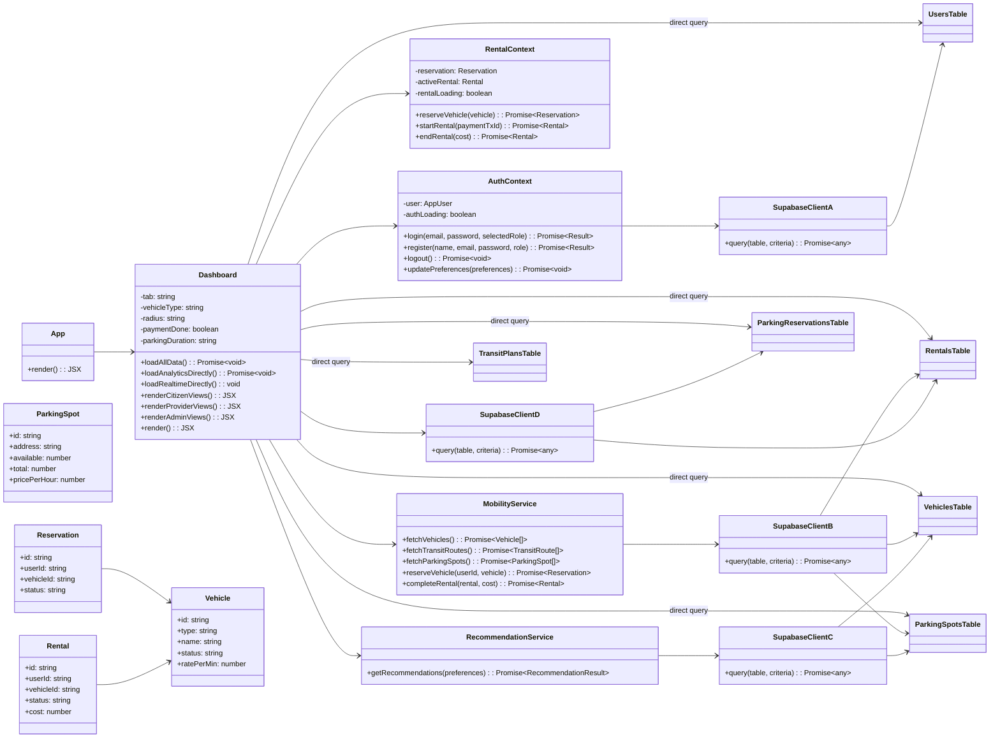
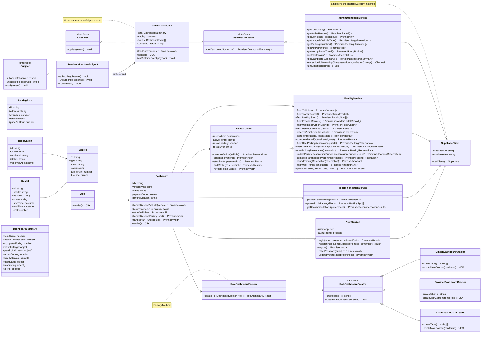
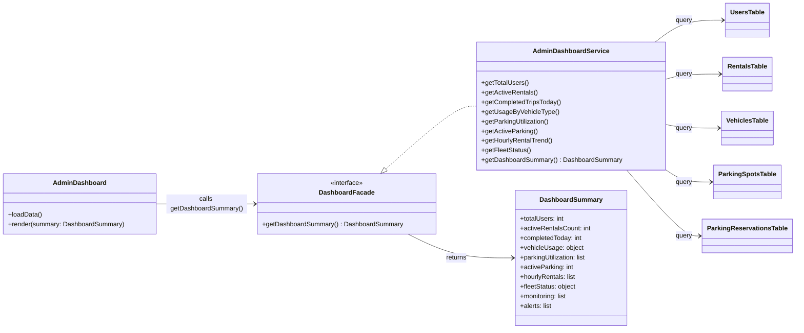
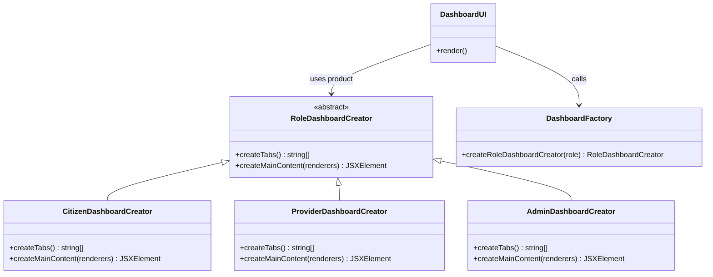
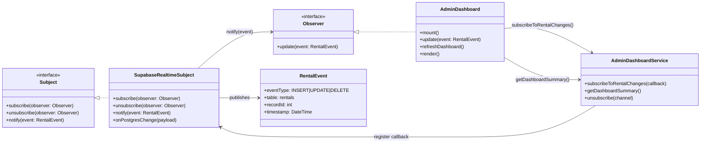
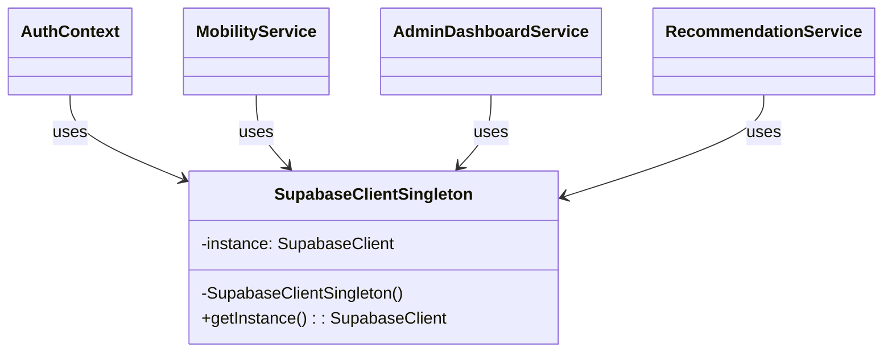

# Diagrams

This file embeds all Mermaid diagrams so GitHub can render them directly.

## Class Diagram (Design Phase)
Source: [Class diagram/class-diagram (design phase).mmd](./Class%20diagram/class-diagram%20(design%20phase).mmd)

## Class Diagram (Implementation - No Design Pattern)
Source: [Class diagram/class-diagram (implementation no design pattern).mmd](./Class%20diagram/class-diagram%20(implementation%20no%20design%20pattern).mmd)

## Class Diagram (Implementation - With Design Pattern)
Source: [Class diagram/class-diagram (implementation with design pattern).mmd](./Class%20diagram/class-diagram%20(implementation%20with%20design%20pattern).mmd)

## Facade Pattern
Source: [Design patterns diagram/Facade pattern.mmd](./Design%20patterns%20diagram/Facade%20pattern.mmd)

## Factory Pattern
Source: [Design patterns diagram/Factory pattern.mmd](./Design%20patterns%20diagram/Factory%20pattern.mmd)

## Observer Pattern
Source: [Design patterns diagram/Observer pattern.mmd](./Design%20patterns%20diagram/Observer%20pattern.mmd)

## Singleton Pattern
Source: [Design patterns diagram/Singleton pattern.mmd](./Design%20patterns%20diagram/Singleton%20pattern.mmd)

